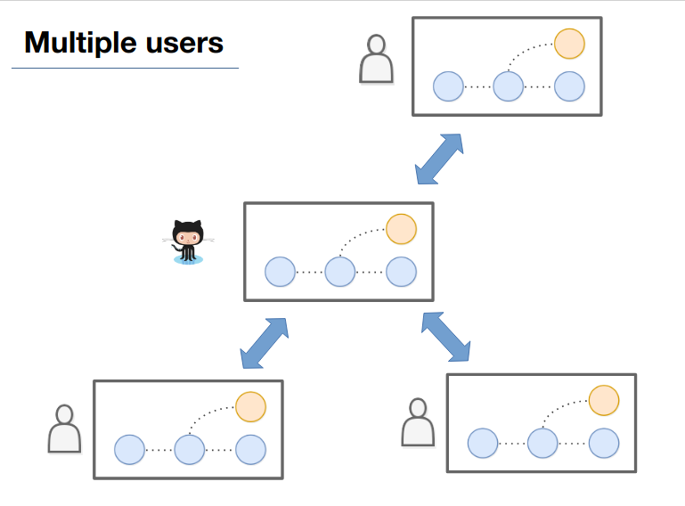

# Introduction

First, we will go through how to perform the different steps shown in the presentation.

You need to have Git installed. Git is available for free here: https://git-scm.com

If you prefer to work through a graphical interface rather than the terminal, take a look at the following two software:

* On Windows: [GitHub GUI](https://desktop.github.com/)
* On Linux: [GitKraken](https://www.gitkraken.com/)

To visualize how your repository looks, you can use the following tool: http://git-school.github.io/visualizing-git


# Key terms


# Working with a local repository

### Create an empty repository with `git init`

To create a new repository we use the command `git init`. This will setup Git to track what is going on in a particular directory and its sub-directories.

Open a terminal and navigate to the folder you want to create your Git repository. (In the writing I will assume you are doing this from a terminal, but you can most likely do the steps through one of the graphical interfaces as well).

```
$ git init
```

Now we have told Git to create a **repository** to track the folder and the subfolders in the **file tree**. What we have now can be illustrated as following:

Next, create some raw text files in the folder which we can add to the repository. You could for instance create them with Notepad on Windows, or Gedit on Linux or TextEdit on Mac. 

At this point it could look something like the following:


### Add files to the stage using `git add` and checking the status using `git status`

Now, select some (or all) of the files and add them to the **stage**. The example here expects that you have created two files with the names `file1.txt` and `file2.txt` in your top directory.

First, let's check the status of the repository using `git status`.

```
$ git status
On branch master

No commits yet

Untracked files:
  (use "git add <file>..." to include in what will be committed)

    file1.txt
    file2.txt

nothing added to commit but untracked files present (use "git add" to track)
```

This tells us that we have untracked files present in the file tree, but not part of the repository. Next, we use `git add` to add them to the **stage** to prepare them to be included. The nice thing with `git add` is that we can select some or all of the changes in our files, the ones we want to include in our first **commmit**.

```
$ git add file1.txt
$ git add file2.txt
```

Now, check the status using the command `git status`.

```
$ git status
On branch master

No commits yet

Changes to be committed:
  (use "git rm --cached <file>..." to unstage)

	new file:   file1.txt
	new file:   file2.txt

```

We have files added to stage, and things ready to commit. Compare this to the illustration shown in the presentation.

Finally, let's create our first **commit**. We do this using the `git commit` command together with a message describing what we do.

```
$ git commit -m "First commmit settig up two files"
[master (root-commit) fc42ace] First commit setting up two files
 2 files changed, 4 insertions(+)
 create mode 100644 file1.txt
 create mode 100644 file2.txt
```

Run `git status` again to check the status of your repository.

```
$ git status
On branch master
nothing to commit, working tree clean
```

Compare this to the process shown in the presentation (the files are not the same, and it is the second performed commit, but the principle is the same).


### Navigating the history with `git log`, `git checkout` and `git diff`

Now, repeat the process above to build some more history and get the hang of the initial commands. Make at least three commits to your repository. 

Make sure to include the following types of changes in your snapshots:

* Adding new files that didn't exist in previous commits
* Change the content of an existing file
* Completely remove an existing file that was present in a previous commit

Now we have several **commits** representing different snapshots of the state of the history of the **repository**. We can get the history leading up to the current commit using `git log` or `git log --oneline` for more compact format:

```
git log --oneline
39a2b92 (HEAD -> master) Remove file
f434e12 Edit file 2
cf7711c Create additional file
fc42ace First commit setting up two files
```

Some things to note:

* The `HEAD -> master`. The `HEAD` indicates were we currently are looking, meaning what snapshot is present in the **file tree**. If moving the `HEAD` the file tree will change to the corresponding state even if the repository stays the same.
* `master` is the name of the default main branch, and the last commit in that branch will always have that label. Each branch will have its own label.
* The first column (starting with `39a2b92`) contains parts of **commit IDs** which we can use to uniquely identify each commit.

Now, let's explore the history. We do this using the `git checkout` command. It is used to take a look at other commits, branches or tags. We can access the commits by using the IDs we can see by running `git log`. Select one of your first commits in this way.

```
git checkout cf7711c  # Replace 'cf7711c' by one of your commit IDs
```

Check the output from `git status` and `git log`. What does it tell you? Also, take a look at the files at you computer. They now are there in the exact state they were when initially taking the snapshot.

Go back to your last commit by running `git checkout master`. Check `git status`, `git log` and the file tree again and make sure you understand what is going on.

Finally, let's use `git diff` to see what has happened since the commit you investigated.

```
git diff cf7711c  # Replace 'cf7711c' with the commit you used above
```

Illustration of when looking at the last commit:


Here, we are looking at a previous commit. The file tree has changed.


We can use `git diff` to see exact differences in the history.


### Tags

You can mark particular commits using tags. These can be used to easily refer to important versions, and can be used as targets when running `git checkout`.

The easiest way to create a tag is by running:

```
$ git tag v1.0.0
```

You can list the available tags:

```
$ git tag
```

Note for later: Tags will not be sent to the **remote** by default, but will be included if instead of running `$ git push` running `$ git push --tags`.

### Working with branches

Branches is a central part of Git, but is beyond the scope of this tutorial. Briefly, you can create a new branch by running `git branch <name>` and replacing `<name>` by the name of your new branch.

```
$ git branch second_branch
```

You can list the branches you have available.

```
$ git branch
* master
  second_branch
```

You can switch between branches using `git checkout`.

```
$ git checkout second_branch
Switched to branch 'second_branch'
```

You can do work here which at this point isn't seen at the `master` branch. When ready to merge it into your master branch you first go back to the master.

```
$ git checkout master
```

Then, you use the command `git merge` to incorporate the changes into the master. If no conflicting changes are made this is a smooth process. If there *are* conflicting changes you have a **merge conflict**. This can be intimidating in the beginning, but it in principle only is a point were you have to decide which of the conflicting changes to keep. When done, both conflicting snapshots will be part of your history, as well as a snapshot of the resulting merge.

```
$ git merge second_branch
```

Illustration of a Git branch:


If you have the time, try the following:

* Create a branch
* Switch to it and develop some features
* Switch back to the `master` and do some conflicting changes
* Use `git merge` to merge the edits on the branch
* Investigate the resulting file and figure out how to select the changes you want to keep

### Setting up a GitHub remote

When using Git we often use a second repository to which we mirror our changes. This repository can be another folder on your computer, on a local server or on a web page such as GitHub or GitLab.

Now, let's setup a new repository on GitHub and use that as your remote.

After creating a new repository on GitHub you do in principle only need to commands to link your local repository to it.

First, we assign it as the **remote** of your local repository.

```
# Replace the GitHub-path with the path to your own repository
git remote add origin https://github.com/Jakob37/test.git
```

You can verify what remote you have set locally by running:

```
git remote -v
```

Now we are ready to send our changes to the remote. We usually do this by simply running `git push`, but the first time you need to set it up so that your **master** is linked to the remote **origin** - the default main branch on your remote.

```
git push -u origin master
Counting objects: 15, done.
Delta compression using up to 4 threads.
Compressing objects: 100% (10/10), done.
Writing objects: 100% (15/15), 1.31 KiB | 671.00 KiB/s, done.
Total 15 (delta 1), reused 0 (delta 0)
remote: Resolving deltas: 100% (1/1), done.
remote: 
remote: Create a pull request for 'master' on GitHub by visiting:
remote:      https://github.com/Jakob37/test/pull/new/master
remote: 
To github.com:Jakob37/test.git
 * [new branch]      master -> master
Branch 'master' set up to track remote branch 'master' from 'origin'.
```

Now you should be able to explore your repository on GitHub.

After this you can send new commits using `git push` and retrieve commits sent to the remote using `git pull`.

At this point your repository could be visualized in the following way:


Things to investigate:

* Look through your commit history on GitHub. This is similar to when you run `git log` locally.
* If you have local tags, send them with `git push --tags` and see if you can find them at GitHub.
* If you have local branches you want to send this is possible by checkout out that branch locally and then send it to the remote `git push -u origin feature_branch_name`

# Commands recap

Here is the Git commands used in this tutorial. There are more commits, but these will be enough for most tasks. See if you remember what they do.

* `git init`
* `git add` 
* `git commit`
* `git remote`
* `git branch`
* `git push`
* `git pull`
* `git status`
* `git diff`
* `git log`
* `git checkout`
* `git tag`

# Bonus exercise: Collaborate in exploring a dataset

Take a look at the `glass_data.csv` file present in this repository. It contains 214 measurements of different types of glass and contains the following columns:

```
id_number	refractive_index	Na	Mg	Al	Si	K	Ca	Ba	Fe	glass_type
```

Find a friend and explore this dataset together. The characteristics can be used to predict the `glass_type`. Make a joint repository to GitHub. Do some work in parallel and try sending your own changes and retrieving changes from your friend.


I did some exploration of this dataset. Feel free to check it out here (can you beat my cross-validation accuracy of 80%?):

https://github.com/Jakob37/MLTemplateDataExplorations/blob/master/gem_color/Gem%20color.ipynb

Good luck with your future Git usage!



# Links

* How to learn it
Codecademy - Interactive online tutorial (free):
https://www.codecademy.com/learn/learn-git
* DataCamp - Comprehensive online tutorials (not free):
https://www.datacamp.com/courses/introduction-to-git-for-data-science
* For deeper understanding:
https://www.sbf5.com/~cduan/technical/git
* My materials:
http://ponderomatics.com/git.html

